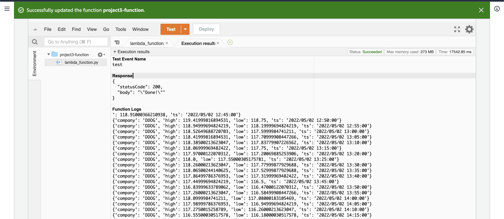
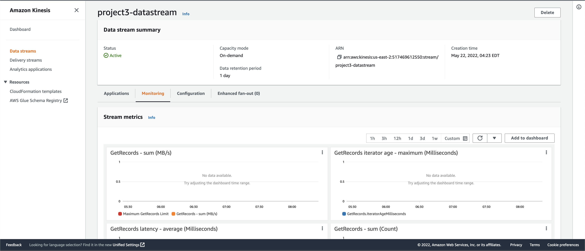
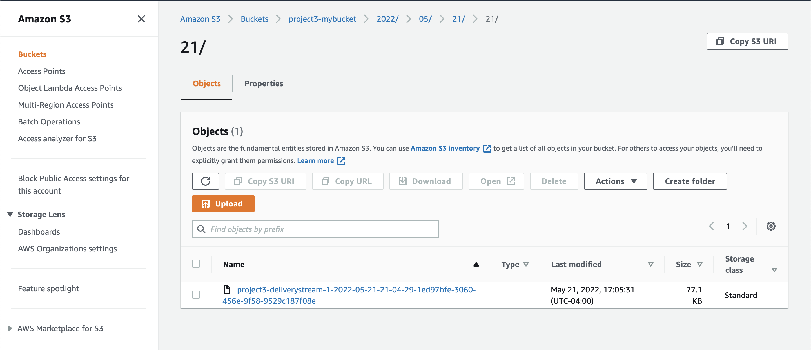

Project 3: Streaming Finance Data with AWS Lambda

 

#Introduction

For this project, I provisioned a Lambda function to generate a real time data pipeline for finance data records for interactive querying. 

#Data Transformation

Create a lambda function, using the **yfinance** module, to grab pricing information for each of the following stocks:

●    **Facebook (FB)**
●    **Shopify (SHOP)**
●    **Beyond Meat (BYND)**
●    **Netflix (NFLX)**
●    **Pinterest (PINS)**
●    **Square (SQ)**
●    **The Trade Desk (TTD)**
●    **Okta (OKTA)**
●    **Snap (SNAP)**
●    **Datadog (DDOG)**

I collected **one full day’s worth of stock HIGH and LOW prices** for each company listed above on Monday, May 2nd 2022, at a five-minute interval. ‘history’ function from yfinance library was applied to extract historical data.

##Execution Results in AWS Lambda Management Console 
****

#Data Collecting

##Kinisis Configuration
****

##Data Collected in S3 Bucket
****

#Data Analysis

I set up a Glue crawler so that I can run AWS Athena queries against finance data in S3 bucket. In Athena, I wrote and ran a query to get **the highest hourly stock “high” per company** from the companies list above. 

##Query Results

#Data Visualization

With the query data from AWS Athena, I imported it into Pandas DataFrames to generate 4 visualizations as follow:

1)    Highest Stock Price at the First Trading Hour (Hour: 9) (A Bar Chart: Each bar refers to a company)
2)    Highest Hourly Stock Price Trend (A Line Chart: Each line refers to a company)
3)    Comparison of Opening (Hour: 9 )and Closing (Hour: 15) Price (A Grouped Bar Chart: Each group refers to a company and the bars refer to the opening and closing prices)
4)    Average Highest Hourly Stock Price (A Bar Chart: Each bar refers to a company)

 
